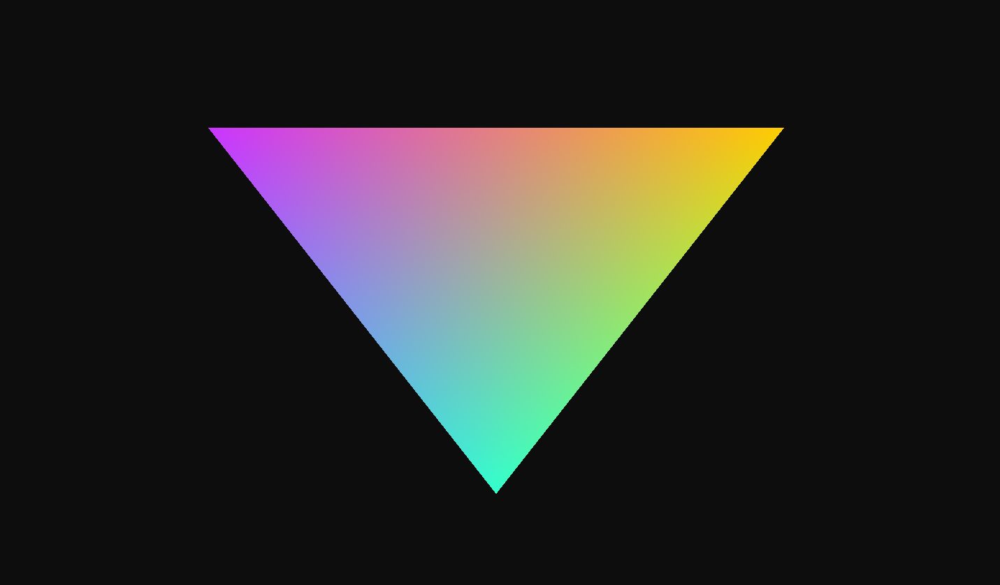

# OpenGL Getting Started

## What is this?

## For whom is this for?

Beginners, people who struggle with copying learnopengl's tutorial about vertex array objects and vertex buffers, failing to render more than one object

## What do you need?

- `CMake`
- for VSCode the `CMake Tools` extension from Microsoft
- a compiler of your choice (`clang`, `gcc`, `msvc`)

## Assumptions

This project template assumes the following things

- Your GPU supports `OpenGL 4.6`
