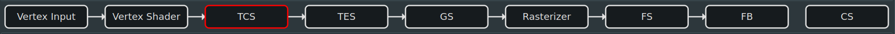

In this chapter we will be adding quite a bit of code, code which will support us finding errors and identifying problems,
because sooner or later we will run into them and we should figure out how to help ourselves as soon as possible.

The amount of code can be a bit overwhelming, but bear with me. It's also not THAT bad.

First of all, quick recap of our project structure from the previous chapter.

```
OpenGLGettingStarted
├── lib
│   └── CMakeLists.txt             # here we describe all third party dependencies
│                                  # like glfw, glad, spdlog, imgui, ...
├── src
│   ├── 01-01-BasicWindow
│   │   ├── Main.cpp               # guess what is in here
│   │   └── CMakeLists.txt         # or here
└── CMakeLists.txt                 # Thats our solution file
```

We need to extend it so that we will create a new directory in `src` and call it `01-02-BasicWindowAndTriangle`.
We copy paste `Main.cpp` and `CMakeLists.txt` from `src/01-01-BasicWindow` into the newly created directory and make
sure to adjust `CMakeLists.txt` accordingly - it should just be naming things for now - I hope you can figure that out by yourself.

Now is probably a good time to talk about the graphics pipeline.

### Vertex Input


DirectX is calling it `Input Assembly`, I also kind of like this name better for some reason. Anyway. Our models and meshes we want to render are made out of vertices. We may want to render them as lines, points, or triangle fans, but for now we'll do a triangle list, and that is setup here in the input assembly or vertex input stage.

!!! note "I might use `Input Assembly` or `IA` instead of vertex input when I elaborate on things, out of habit, but I mean `Vertex Input`"

You might have seen export options in tools such as [Blender](https://blender.org) or perhaps fiddled with libraries like [Assimp](https://github.com/assimp/assimp) where options like `Triangulate Vertices` exist of some form. That's why. Artists might use "quads" or other topologies, but the graphics card likes to munch on triangles.

That is also a good point to introduce a construct like `Vertex` or to be more specific in our case a `VertexPositionColor` construct.

```cpp
--8<-- "src/01-02-BasicWindowAndTriangle/Main.cpp:14:18"
```

A vertex is each point in a model or mesh describing its position in model space amongst other attributes, like color in this specific one. Vertices can also hold other attributes such as texture coordinates (aka `UVs`), normals, tangents or anything else really.

It usually depends on what kind of thing you are actually trying to implement here but in most cases its one or more of the aforementioned attributes. We will be using textures and normals later on for instance.

Speaking of instance. Models and meshes can also be "instanced" by the `GPU`. Think of copies of the same model or mesh but placed somewhere else, like a Tree in a forest, grass or an asteroid in an asteroid field. Information about those instances can also be encoded into the Vertex, but we will not make use of it in this guide because there are better means to do so IMHO but I wanted to mention it briefly. How instancing works I will also explain later.

!!! note "Model or Mesh"

    ...are terms which can be used interchangably here, both are collections of vertices mainly. I might find a better term for it later and adjust this guide accordingly.


Back to the `Vertex Input`. We have our vertices, which we might have been loaded from a model file  or are arranged in a list to make up some primitive shapes like a box or sphere. We also have our primitive type which can be point, line, line-strip, triangle-strip, triangle-fan and triangle.

Our vertices are usually collections of `Vertex` and those are sent over to the `GPU` that they can be used to render them.

Let's declare that thing right after we initialized `OpenGL` with default values after `glClearDepth(1.0f);`

```cpp
--8<-- "src/01-02-BasicWindowAndTriangle/Main.cpp:182:187"
```

Those collections are stored in a buffer. The `GPU` can access them to retrieve whatever information is stored in them, in this case vertices and the buffer in this specific instance is called `vertex buffer`.

Buffers are a generic thing in `OpenGL`, a blob of memory with size if you will.

!!! note "Explain buffers here, perhaps in more detail"

To create a buffer we simply call these functions and stuff the vertex collection right into it. 

```cpp
--8<-- "src/01-02-BasicWindowAndTriangle/Main.cpp:189:191"
```

!!! note "Elaborate"

    Explain immutable storage and the difference to the old glBindBuffer stuff?

We need one more thing to complete the Vertex Input stage. We need it to tell the `GPU` how to interpret the data coming from the vertex buffer(s).

That thing is unfortunately named `Vertex Array Object` (or `VAO` in short) in OpenGL. God knows why, but we have to deal with it.

I have a better name for it. I would like to call it `Input Layout` (I might refer to it as `IL` too). It makes much more sense to me because the input layout as the name suggests describes a layout of sorts for some input. And if  you remember we are in the `Vertex Input` stage still. 

The input layout is created as follows:

```cpp
--8<-- "src/01-02-BasicWindowAndTriangle/Main.cpp:193:202"
```

Per vertex attribute (we have 2 attributes, `Position` and `Color`) we declare what data type each attribute is and of how many components that data type exists.

If you think of Position, usually 3 coordinates, x, y and z, also usually floating points - we have 3 components of type `GL_FLOAT`. Thats exactly what we describe here.

Same thing for the color attribute. Red, green and blue components, so, also 3 components of type `GL_FLOAT`.

You can source vertex data from one or many vertex buffers, thats what the `glVertexArrayAttribBinding` call is for. In our case we want to use one vertexbuffer for the whole vertex data. You often see a setup where each attribute is stored in their own buffer.

!!! note "Elaborate"

    Explain AOS/SOA/Interleaved/NonInterleaved VertexFormat?

Last but not least, we associate our vertex buffer with our input layout.

```cpp
--8<-- "src/01-02-BasicWindowAndTriangle/Main.cpp:204:204"
```

!!! danger "Exercise"

    Can you create a vertex type similar to our `VertexPositionColor` which has 2 more attributes. I also want normals and tangents. The former usually is a `glm::vec3` the latter a `glm::vec4`. How would you name it? And how would the corresponding input layout look like?





Compute Pipeline

