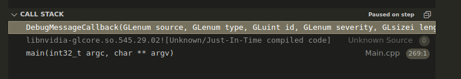
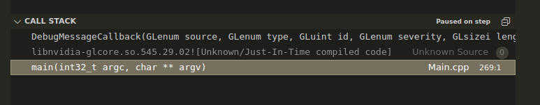
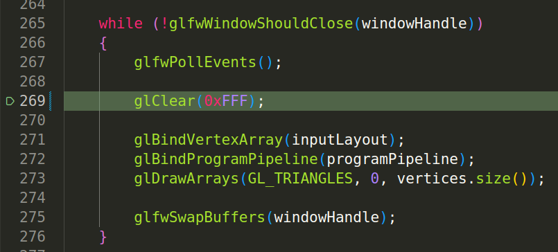

### Debug Callback Exercise 1

- Go to the debug callback and set a break point at the end of the function
- Go to the main loop and find the `glClear(GL_COLOR_BUFFER_BIT);` call.
- Replace it with `glClear(0xFFF);` 
- Compile and run

What do you see?

```
[2023-11-23 21:22:15.640] [error] OpenGL Message: 33356 GL_INVALID_VALUE error generated. Operation is not valid from the core profile.
Source: API
Type: Error
Severity: high
```

You get this output in the output window... something something invalid value... thats our first clue.

Let's check the callstack. Im using Visual Studio Code here.



Our program is quite simple at the moment so there is not much to see. But we do see the debugcallback at the top, them entry which goes into the graphics driver, and below the caller issuing the last gl command. Which in this case...



... sits in the main function at line 269.

We get the offending call there. `glClear(0xFFF)`



What did the error message say again? `GL_INVALID_VALUE`.

What do we do now?
Ideally look at the opengl specification to figure out what VALID values glClear can take.

[OpenGL Specification](https://registry.khronos.org/OpenGL/specs/gl/glspec46.core.pdf)

Find the clear call in there and fix the problem.

Then compile and run the program again and see if it fixed the issue.

