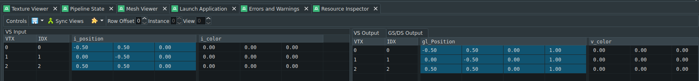

Find this line in the `Main.cpp` of `BasicApplicationAndTriangle`

`glEnableVertexArrayAttrib(inputLayout, 1);`

and comment it out. You should get a black triangle and most likely no further output about that something is "wrong".

Uncomment it, and compile it again, then take a capture with `RenderDoc`, so that you have something to compare against.

Then comment it out again, compile it again and then take another capture with `RenderDoc`.

Go through the windows and stages in both captures and try to find what is wrong.

... Really try to compare the two without reading beyond this line of text ...

We purposefully modified something in the input layout (VAO) which is part of which stage of the graphics pipeline?

Exactly: `Input Assembly` (IA). Thats the one were you should look closer.

You can see the 2nd attribute is not enabled - since we purposefully commented that out - and the rest of the attribute is therefore
ignored.

You can go check further now how it affects how OpenGL is reading the contents of the vertex buffer, by clicking on that arrow in the "Go" column on the far right.

Can you see it? `i_color` values are all zero, the vertex shader transports that value further in form of `v_color` over to the fragment shader and the values of 0.0f stay.

Now a color of 0.0f, 0.0f, 0.0f maps to `Black` and that's exactly what we see here.